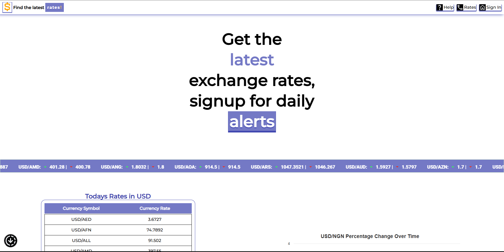
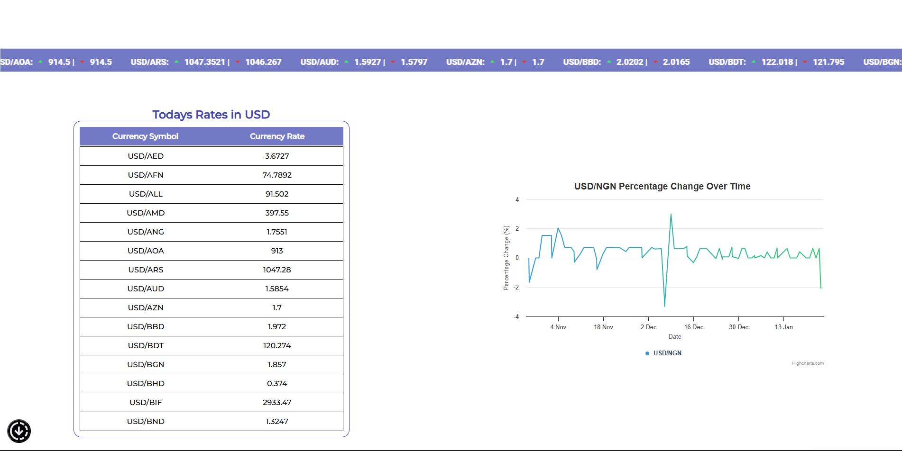

# Daily Currency Rate

This is a Daily Currency Rate Application. Built as a Progressive Web Application, it works offline on mobile platforms like Android and iOs, including Destop devices-as long as they can run a web browser.

## Features

- Display over 40 currencies

## Screenshot

  



## Installation

To install and run the application locally, follow these steps:

1. Clone the repository:

    ```bash
    git clone https://github.com/yourusername/Daily-Currency-Rate.git
    ```

2. Navigate to the project directory:

    ```bash
    cd Daily-Currency-Rate
    ```

3. Install the dependencies:

    ```bash
    npm install
    ```

4. Start the application:

    ```bash
    npm start
    ```

## Usage

Once the application is running, you can access it in your web browser at `http://localhost:3000`. The application will display the current exchange rates for over 40 currencies.

## Contributing

If you would like to contribute to the project, please follow these steps:

1. Fork the repository.

2. Create a new branch:

    ```bash
    git checkout -b feature-branch
    ```

3. Make your changes and commit them:

    ```bash
    git commit -m "Description of your changes"
    ```

4. Push to the branch:

    ```bash
    git push origin feature-branch
    ```

5. Open a pull request.

## License

This project is licensed under the MIT License. See the [LICENSE](./LICENSE) file for details.
